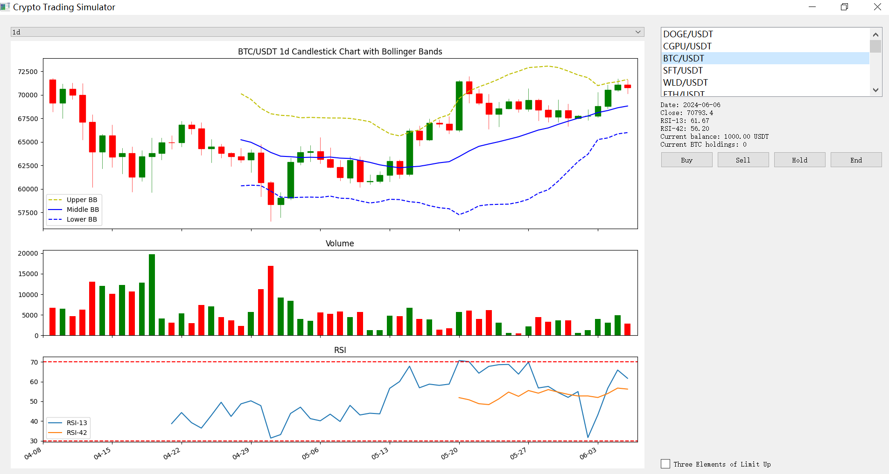

##Design a training evaluation program, using python ccxt gateio to fetch cryptocurrency daily/4hours/1hour K-line data

##Calculate bollinger bands, rsi13, rsi42 indicators, display daily K-line candlestick chart, volume candlestick chart, rsi chart

##Manually predict the next day's price trend, decide "hold", "buy", "sell" operations, and record log and sell profit/loss percentage

##Display the next actual data after each operation on the daily K-line

##Add a checkbox named "Three Elements of Limit Up", after a limit up, encountering such a pullback, a big rise limit up appears at the low position, the second does not break half of the big yang position in the following three days, the third appears to swallow the yang K and swallow the previous three K lines, then the main force pull-up strategy is established. Implement an automatic reminder function for buying points based on this model content, and mark the number 3 on the buying point.

# Cryptocurrency Simulator UI - more excercise, more successful?

